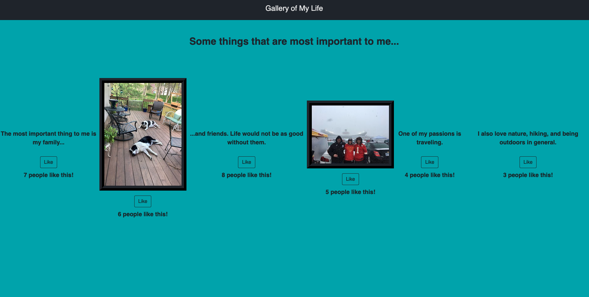

# Weekend React Gallery

## Description

I created an application that represents a gallery of the things that are most important to me using React. I focused on using multiple components so that additional picures can be added. Using conditional rendering, a user can toggle between a photograph and a brief description of that photograph by clicking on the photo and then the description. I also added an interactive button that allows a user to like a photograph. If a user likes a photograph, I used the PUT method to send the data to the server where the number of likes is recorded and can accept additional likes.

### Screen Shots

### Prerequisites

- Node.js
- Express.js

## Installation

1. Clone the project from Github
2. Open in text editor of your choice
3. Open the terminal and run the command `npm install` to install the necessary dependencies
4. Run the command `npm run server` in your terminal to start the server
5. After starting the server, run the command `npm run client` to open the browser 
6. If the browser does not automatically open, enter `localhost:3000` in the URL
7. When you are finished, type `control + C` to stop server

## Usage

1. A user will see a gallery of pictures of things that are most important to me
2. If a user clicks on any of the pictures, they will then be able to see a brief description of that picture
3. The user can click on the `Like` button to like a picture
4. The number of likes per picture are recorded below the `Like` button

## Built With

- HTML
- CSS
- JavaScript
- Bootstrap
- React
- Node.js
- Express.js

## Acknowledgement
Thanks to [Prime Digital Academy](https://www.primeacademy.io) who equiped and helped me make this application a reality.

## Support
If you have suggestions or issues, please email me at [jmotes2583@gmail.com](mailto:jmotes2583@gmail.com)