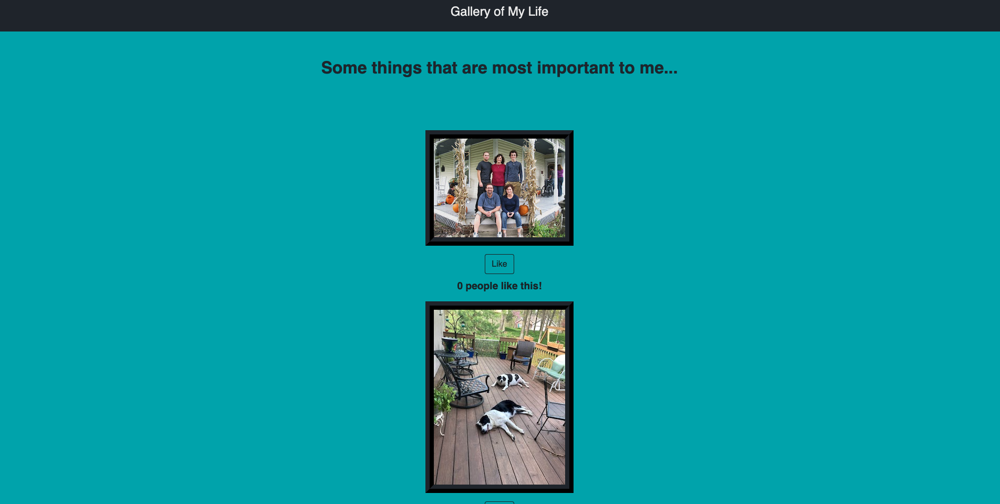
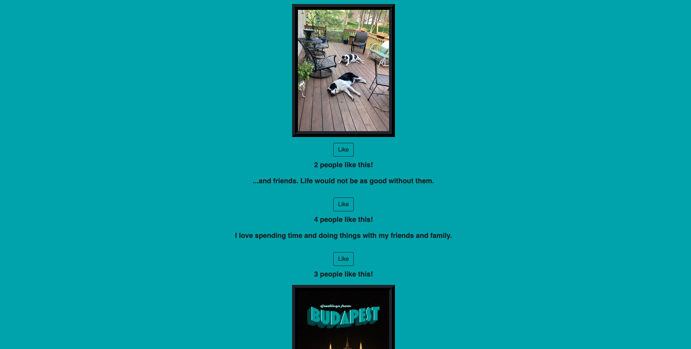

# Project Name

Weekend React Gallery

## Description

I created an application that represents a gallery of the things that are most important to me using React. I focused on using multiple components so that additional picures can be added. Using conditional rendering, a user can toggle between a photograph and a brief description of that photograph by clicking on the photo and then the description. I also added an interactive button that allows a user to like a photograph. If a user likes a photograph, I used the PUT method to send the data to the server where the number of likes is recorded and can accept additional likes.

### Screen Shots

